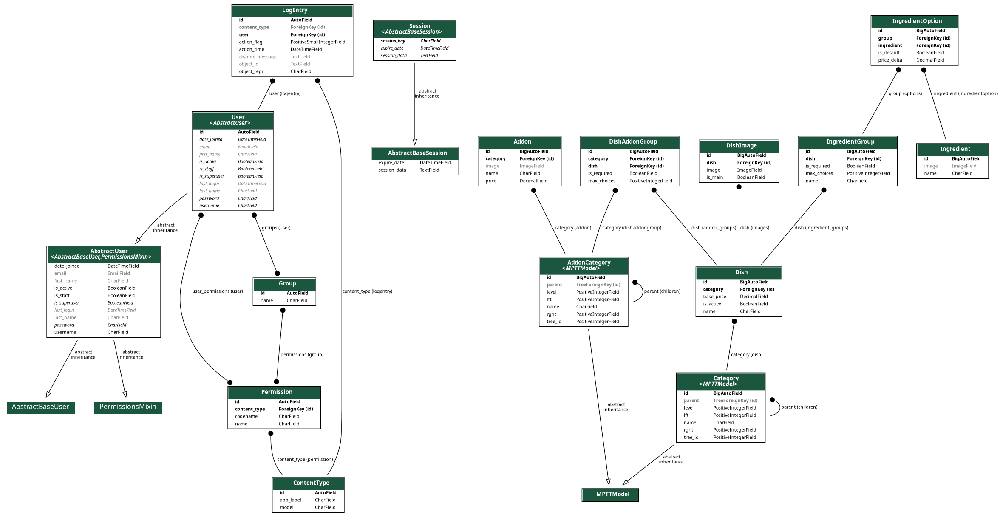

# Restaurant Web Application

A robust web application for restaurant management built with **Django**, **PostgreSQL**, and **Docker**. This project is designed for easy collaboration and scalable deployment.

## Features
- **Menu management**: categorized dishes with images, add-ons, and ingredient options (MPTT categories).
- **REST API**: public menu catalog, JWT auth, cart, checkout, and orders.
- **Dockerized architecture**: consistent environment for all developers.
- **PostgreSQL**: production-ready database setup.

## Prerequisites
Before you begin, ensure you have the following installed:
- [Docker](https://docs.docker.com/get-docker/)
- [Docker Compose](https://docs.docker.com/compose/install/)

## Getting Started

### 1. Clone the repository
```bash
git clone https://github.com/Primary17/restaurant-webapp.git
cd restaurant-webapp
```

### 2. Set up environment variables
Copy the example environment file and adjust values if necessary:
```bash
cp .env.example .env
```

Set a strong `DJANGO_SECRET_KEY` in `.env` for any non-local deployment. With `DEBUG=0`, configure `CORS_ALLOWED_ORIGINS` as a comma-separated list of allowed frontend origins (for example `https://app.example.com`).

### 3. Build and run with Docker
Start the containers in detached mode:
```bash
sudo docker compose up --build -d
```
The application will be available at: http://localhost:8000

## API documentation (OpenAPI)
Interactive request/response schemas and “Try it out” are available at:
- **Swagger UI**: http://localhost:8000/api/docs/
- **ReDoc**: http://localhost:8000/api/redoc/
- **Raw OpenAPI schema (JSON)**: http://localhost:8000/api/schema/

The schema is generated by **drf-spectacular** from Django REST Framework view/serializer definitions, so it stays aligned with the code.

### Main HTTP endpoints (overview)
| Area | Method | Path | Notes |
|------|--------|------|--------|
| Auth | POST | `/api/users/register/` | Create account; returns JWT + user. |
| Auth | POST | `/api/users/login/` | JWT access + refresh; includes `user` in the login serializer response. |
| Auth | POST | `/api/users/refresh/` | Refresh access token. |
| Profile | GET, PATCH | `/api/users/me/` | Authenticated user profile. |
| Menu | GET | `/api/menu/categories/` | Category tree (roots with nested `children`). |
| Menu | GET | `/api/menu/dishes/` | Active dishes; query params: `category`, `search`, `ordering` (`name`, `-name`, `base_price`, …). |
| Menu | GET | `/api/menu/dishes/<id>/` | Dish detail with images, add-on groups, ingredient groups. |
| Cart | GET | `/api/orders/cart/` | Current user’s cart. |
| Cart | POST | `/api/orders/cart/items/` | Body: `dish_id`, `quantity`, optional `addons`, `ingredients` (validated against menu rules). |
| Cart | PATCH, DELETE | `/api/orders/cart/items/<id>/` | Update quantity or remove a line. |
| Cart | POST | `/api/orders/cart/checkout/` | Create order from cart; body: `address`, optional `comment`. |
| Orders | POST | `/api/orders/` | Create order from JSON body (same line shape as cart checkout payload builder). |
| Orders | GET | `/api/orders/my/` | List current user’s orders. |
| Orders | GET | `/api/orders/<id>/` | Order detail (owner or staff/admin). |
| Orders | PATCH | `/api/orders/<id>/status/` | Staff/admin only; body must include a valid `status` value. |

Unauthenticated clients can read the **menu** endpoints; cart and orders require a JWT (`Authorization: Bearer <access>`).

## Core Business Logic & Architecture

### 1. Advanced Filtering System

The backend uses Django ORM and optimized sequential filters for menu queries (`GET /api/menu/dishes/`).

### Hierarchical Category Filtering (MPTT)

Implemented with django-mptt. Filtering by a parent category automatically includes all nested categories:

```python
category__in=category.get_descendants(include_self=True)
```

For example, selecting **Beverages** also returns **Soft Drinks** and **Lemonades** without recursive database overhead.

### Dietary Filtering

Supports filters such as:

- `is_vegan`
- `is_vegetarian`
- `is_gluten_free`
- `is_lactose_free`
- `is_nut_free`

using strict AND/OR logic to ensure ingredient safety.

#### Ingredient-Based Filtering

Allows dynamic filtering by allergens or specific ingredients through database relations.

#### Database Optimization

Uses the `dish_category_active_idx` composite index `(category, is_active)` for fast query execution.

### 2. Dish Customization Architecture

Customization logic in `POST /api/orders/cart/items/` is divided into three architectural flows:

```json
{
  "dish_id": 3,
  "quantity": 2,
  "ingredients": [15],
  "removed_ingredients": [11],
  "added_ingredients": [7]
}
```

#### Ingredient Removal (`removed_ingredients`)

Stores IDs of ingredients removed from the original recipe (e.g., *No Tomatoes*), changing the dish composition without affecting the base price.

#### Dish Variations (`ingredients`)

Managed through the `IngredientOption` model. Handles mutually exclusive variations inside limited-selection groups, such as steak doneness or required portion size.

#### Paid Add-ons (`added_ingredients`)

Implemented via the `Addon` model. Supports optional paid toppings and sauces that can be combined together and are structured through the `AddonCategory` tree for inventory management.


### 3. Business Logic & Validation Service

Every cart operation is validated through `orders.services.validation_service` to protect against invalid data.

#### Recipe Validation (`validate_removed_ingredients`)

Checks whether the ingredient being removed actually belongs to the original dish recipe.

#### Add-on Validation (`validate_addons_for_dish`)

Validates add-on MPTT categories and blocks incompatible combinations (for example, preventing Cheese Sauce from being added to Lemonade).

#### Hybrid Pricing Logic (Serializers)

The item price is calculated dynamically:

- Fixed Pricing — directly adds the addon cost from `Addon.price`.
- Percentage Delta — if an ingredient group contains `"Розмір"` (Size) in its name, the system automatically switches to a percentage-based modifier from the dish base price (for example, `+20%` for medium size).

## Development commands

### Database migrations
If you've added new models or fields, generate and apply migrations:
```bash
# Generate migration files
sudo docker exec -it restaurant_web python manage.py makemigrations

# Apply migrations to the database
sudo docker exec -it restaurant_web python manage.py migrate
```

### Create a superuser
To access the Django Admin panel (http://localhost:8000/admin), create an admin account:
```bash
sudo docker exec -it restaurant_web python manage.py createsuperuser
```

### Staff accounts (kitchen / orders panel)
Set **Role** (`Staff` or `Admin`) in Django Admin → **Users**. That grants:

- the site staff panel (`/staff/orders/`) and orders API;
- **Staff status** for Django Admin — set automatically when you save (no need to toggle it manually).

**Customer** — only the public site (menu, cart, checkout). Superusers keep full access regardless of role.

After pulling these changes, run `migrate` once so existing users get the correct `is_staff` flag.

### Populate database with sample data
To see the menu with pre-configured dishes (Fine Dining, Drinks, etc.) and their images:
```bash
# Load initial categories, dishes, and ingredients
sudo docker exec -it restaurant_web python manage.py loaddata initial_data.json
```

### Fix category tree (MPTT)
If the menu hierarchy looks broken in the Admin panel:
```bash
sudo docker exec -it restaurant_web python manage.py shell -c "from menu.models import Category; Category.objects.rebuild()"
```

### Static files
To collect static files (CSS, JS, Images) for production:
```bash
sudo docker exec -it restaurant_web python manage.py collectstatic --noinput
```

## Project structure
* `/media/dishes/` — Uploaded images for the menu (check this after `loaddata`).
* `initial_data.json` — JSON fixture containing the sample menu data.
* `/restaurant_site` — Django project root.
* `docker-compose.yml` — Docker services configuration.
* `dockerfile` — Python environment configuration.
* `.env` — Local environment variables (do not commit).

## Handling media files
All dish images are stored in the `/media/dishes/` directory.
- **In development**: Django serves these files when `DEBUG=True`.
- **In production**: Point your reverse proxy (e.g. Nginx) at the `/media` volume.

If images are not appearing after running `loaddata`, ensure the `media/` folder is present in the repository or volume mount.

## Running tests

Tests use PostgreSQL (same as the app). With Docker Compose DB running on port `5433`:

```bash
docker compose up -d
docker compose exec web python manage.py test
```

On push and pull requests, **GitHub Actions** builds the app image and runs migrations plus tests inside Docker (`docker-compose.ci.yml`).

## Deploying to Heroku (GitHub Actions)

The app uses the **Heroku container stack** (`Dockerfile` + `heroku.yml`). After each push to `main`/`master`, CI runs tests in Docker, then builds and releases the image to Heroku.

### 1. Create the Heroku app

```bash
heroku login
heroku apps:create your-app-name
heroku stack:set container -a your-app-name
heroku addons:create heroku-postgresql:essential-0 -a your-app-name
```

### 2. Config vars on Heroku

```bash
heroku config:set DEBUG=0 -a your-app-name
heroku config:set DJANGO_SECRET_KEY="$(python -c 'import secrets; print(secrets.token_urlsafe(50))')" -a your-app-name
heroku config:set ALLOWED_HOSTS=your-app-name.herokuapp.com -a your-app-name
heroku config:set CORS_ALLOWED_ORIGINS=https://your-app-name.herokuapp.com -a your-app-name
heroku config:set CSRF_TRUSTED_ORIGINS=https://your-app-name.herokuapp.com -a your-app-name
```

`DATABASE_URL` is set automatically when Postgres is attached.

### 3. GitHub repository secrets

In **Settings → Secrets and variables → Actions**, add:

| Secret | Description |
|--------|-------------|
| `HEROKU_API_KEY` | [Account API key](https://dashboard.heroku.com/account) |
| `HEROKU_APP_NAME` | App name (e.g. `your-app-name`) |

### 4. Deploy

Push to `main` (or `master`). The workflow `.github/workflows/django-ci.yml` will test, push the Docker image, and run `heroku container:release`. Migrations run via the `release` phase in `heroku.yml`.

Uploaded media on Heroku are ephemeral; use S3 or similar for persistent files in production.

## Contributing
1. Create a new branch: `git checkout -b feature/your-feature-name`.
2. Commit your changes: `git commit -m 'Add some feature'`.
3. Push to the branch: `git push origin feature/your-feature-name`.
4. Open a Pull Request.

## Database schema
To better understand the relationships between dishes, ingredients, and categories, refer to the schema below:



*Key relations:*
- **MPTT** is used for nested `Category` and `AddonCategory` trees.
- **Nested Admin** allows managing dishes, ingredients, and add-ons on a single page.
